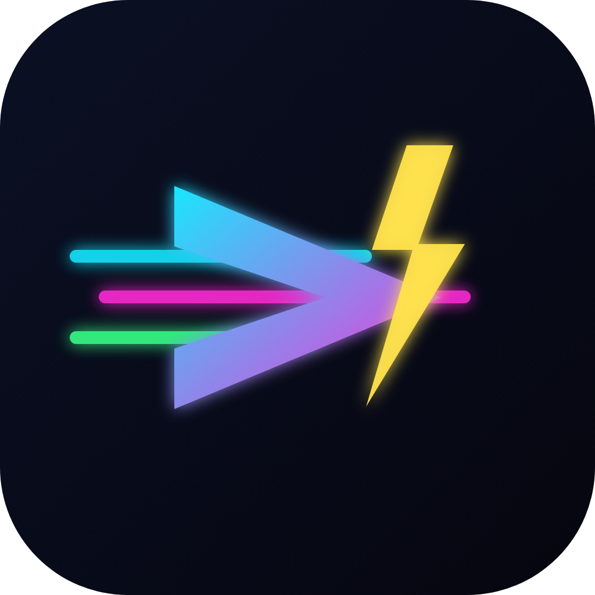

# BLUR — Carreras de combate neón

Juego de **carreras arcade de combate con power-ups de neón** para Android (y navegador),
inspirado en el estilo de los racers de combate vehicular. Construido con **Three.js**
(render 3D) y empaquetado como **APK** con **Capacitor**. Todo el arte, audio y los
modelos 3D se generan por código — sin assets externos.



## 🎮 Características

- **Render 3D** con estética neón nocturna (bloom, estelas, partículas).
- **Física arcade** con derrape/drift, nitro y daño.
- **8 power-ups** estilo Blur, con inventario de hasta 3 (variante adelante/atrás):
  - ⚡ **Bolt** — tres disparos de energía al frente
  - 🎯 **Shunt** — misil teledirigido
  - 💣 **Mine** — mina trasera
  - 🌩 **Shock** — rayos sobre los autos de adelante
  - 🛡 **Shield** — escudo defensivo
  - 🔥 **Nitro** — turbo
  - 💥 **Barge** — onda de empuje
  - ✚ **Repair** — repara tu auto
- **IA** de rivales con línea de carrera, frenado en curvas y *rubber-banding*.
- **Modos:** Carrera rápida, **Campeonato** (puntos + clasificación) y Contrarreloj.
- **6 autos** y **4 pistas** con sistema de **fans** para desbloquear contenido (se guarda en el dispositivo).
- **HUD** completo: posición, vuelta, cronómetro, velocímetro, blindaje, inventario y **minimapa**.
- **Controles táctiles** para móvil (+ inclinación opcional) y **teclado** en escritorio.

## 🕹️ Controles

**Móvil:** botones en pantalla (◀ ▶ dirección, GAS, FRENO, ★ power-up, ⟳ cambiar).
Podés activar dirección por inclinación en *Ajustes*.

**Teclado:**
| Acción | Tecla |
|---|---|
| Acelerar / Frenar | ↑↓ o W/S |
| Girar | ←→ o A/D |
| Usar power-up | Espacio |
| Cambiar power-up | Shift / Q |
| Pausa | P / Esc |
| Disparo hacia atrás | mantener Freno + Espacio |

## 📱 Conseguir el APK (GitHub Actions)

Cada push a la rama compila el APK automáticamente.

1. En GitHub, abrí la pestaña **Actions** → workflow **Build Android APK** → la última corrida.
2. Descargá el artifact **`blur-apk`** (contiene `blur-debug.apk`).
3. Pasalo al celular e instalalo (activá *Instalar apps de orígenes desconocidos*).

Para publicar una **Release** con el APK adjunto, creá un tag:
```bash
git tag v1.0.0 && git push origin v1.0.0
```

## 🛠️ Desarrollo local

Requisitos: Node 18+.

```bash
npm install
npm run dev        # http://localhost:5173 (jugar en el navegador)
npm run build      # build de producción -> dist/
npm run preview    # previsualizar el build
```

### Compilar el APK localmente

Requisitos: **JDK 17** y el **Android SDK** (API 33, build-tools 33.0.2).

```bash
npm run build
npx cap sync android
cd android && ./gradlew assembleDebug
# APK en: android/app/build/outputs/apk/debug/app-debug.apk
```

## 🧱 Arquitectura

```
src/
  main.js              bootstrap + flujo de pantallas y modos
  engine/              renderer (Three.js + bloom), input, audio (WebAudio), util
  game/
    vehicle.js         física arcade, daño, respawn, inventario
    track.js           pista por spline: geometría, muros, meta, proyección/vueltas
    ai.js              IA de rivales
    powerups.js        sistema de power-ups + proyectiles/minas
    pickups.js         pads de power-ups en la pista
    effects.js         explosiones, chispas, ondas
    race.js            orquestación de la carrera, cámara, posiciones
    hud.js             HUD (DOM) + minimapa
    cars.js / storage.js   roster de autos / progreso (localStorage)
  tracks/              definiciones de pistas
  ui/                  menús (screens.js) y controles táctiles (touch.js)
android/               proyecto Android (Capacitor)
.github/workflows/     CI que compila el APK
```

## ⚖️ Nota

Proyecto original para uso personal/educativo. Recrea **mecánicas y estilo** del
género de carreras de combate con power-ups; no incluye marcas, autos ni pistas
de ningún juego comercial — todo el contenido es generado por código.
